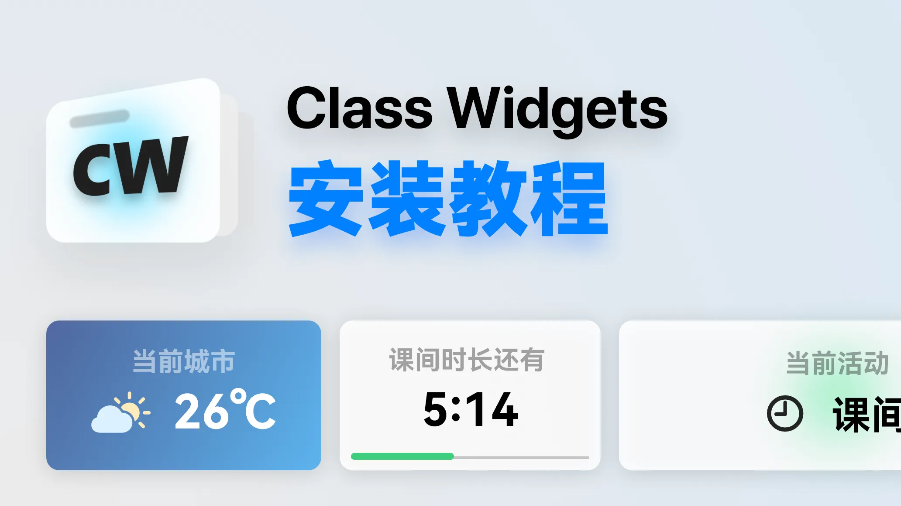

import { Aside } from '@astrojs/starlight/components';

本文将为您介绍如何安装 Class Widgets。

## 确认系统需求

|项目|要求|
|-|-|
|操作系统|Windows 7 以上|
|运行内存|建议 4GB+|

若已满足，请进行接下来的步骤。

## 下载 Class Widgets
您可通过此页面下载 Class Widgets 的二进制文件：
[下载](/download)

## 解压和运行
下载完成后，将软件解压到一个**独立的文件夹**，然后在解压后的文件夹找到 `ClassWidgets.exe` 或 `ClassWidgets` 即可运行。

<Aside>
解压时请~~不要使用“在线解压”~~功能、尽量不要直接解压在“下载”文件夹或其他功能不单一的文件夹中，否则可能会出现无法预知的问题。
请放到单独的文件夹中（如：文档\ClassWidgets）
</Aside>
## 升级 Class Widgets
若您的计算机中已经安装了旧版本的 Class Widgets，您仅需将新版的压缩包的全部内容覆盖至原安装路径即可。
## 出现问题？
如果在 安装/运行 中出现问题，可在社区（如GitHub、BiliBili）中求助。